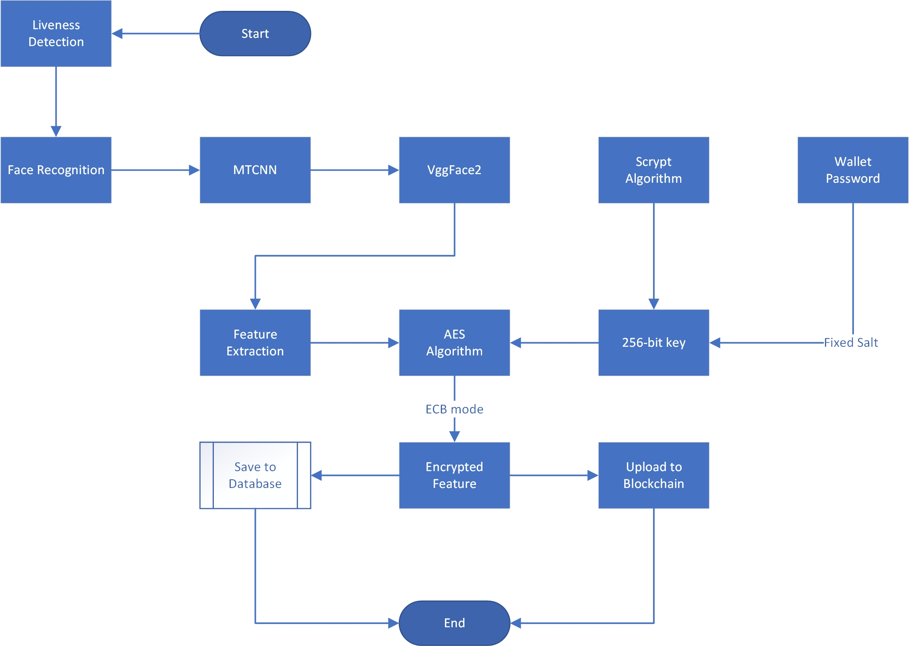

# Facial Recognition in  Hobby Dapp

**Introduction**

In the contemporary landscape of web3 applications, the secure restoration of mnemonic phrases is a critical component, instrumental in maintaining the sanctity and access to digital assets. Recognizing this, Hobby Wallet has pioneered the confluence of biometric features with wallet passwords to facilitate a resilient mnemonic recovery process. The significance of mnemonic phrases in web3 cannot be overstated, as they serve as the foundational element of security - a unique identifier akin to a cryptographic key that unlocks the digital wealth and identity of users.

Biometric characteristics hold paramount importance to the user, serving as a personalized and immutable identifier that is inherently resistant to phishing and other fraudulent attacks. By incorporating these unique identifiers, Hobby Wallet provides users with a security measure that is both natural and inherently difficult to replicate or falsify.

The following discourse details the intricacies of the biometric information registration process within our system, emphasizing its implementation and the technological prowess that underpins its security guarantees.

							System Process and Implementation

						Flowchart for Face Registration in Hobby Wallet

**Liveness Detection**

The commencement of our facial recognition system is marked by liveness detection, a critical safeguard against facial spoofing and the first barrier to potential intruders. Our protocol involves issuing randomized directives to users - such as looking in different directions or performing facial movements - ensuring the presence of a live user. Upon successful validation, the system proceeds to the registration phase.

**Facial Recognition**

Facial recognition begins with the deployment of the Multi-task Cascaded Convolutional Networks (MTCNN), a sophisticated deep learning methodology for detecting and aligning facial structures. The efficacy of MTCNN lies in its dual capability to detect faces and pinpoint key facial landmarks, thereby ensuring the provision of precise facial imagery for subsequent recognition processes. Pre-processing techniques such as resizing, alignment, and normalization are meticulously applied to the face images procured, setting the stage for feature extraction.

The process further evolves as the VggFace2 model processes the outputs of MTCNN. Rooted in deep learning, VggFace2 is a facial recognition technology that differentiates individuals by scrutinizing facial features. This model exhibits exceptional accuracy and reliability in facial recognition, culminating in the generation of a 512-dimensional vector representing the facial features of the user, thereby establishing a foundation for face verification and identification.

**Encryption and Security**

Upon the derivation of facial features, the system employs the Scrypt algorithm to forge a 256-bit key by integrating the user's wallet password with a fixed salt value. Designed for key derivation in cryptographic contexts, Scrypt is intentionally resource-intensive to enhance the difficulty of cracking. This key is subsequently utilized by the AES encryption algorithm.

Post feature extraction, the AES algorithm - specifically, its ECB mode - is tasked with encrypting the data. As a widely adopted encryption standard, AES presents a formidable line of defense, providing a robust security barrier.

**Storage and Blockchain**

The encrypted facial features are securely stored in a database, and in a bid to augment security further, these features are also uploaded to the blockchain. This dual approach ensures the immutability of the information and guarantees the reconstruction and recovery of the wallet, even in the extreme event of server failure.

**Conclusion**

Through the innovative integration of biometric features and wallet passwords, Hobby Wallet sets a new standard for mnemonic recovery in web3 applications. This system not only reinforces user security but also enhances ease of access, thereby providing a balanced solution that addresses the paramount need for security in the digital age. With this, Hobby Wallet reaffirms its commitment to safeguarding digital identities and assets, ensuring that users can navigate the web3 space with confidence and assurance.
