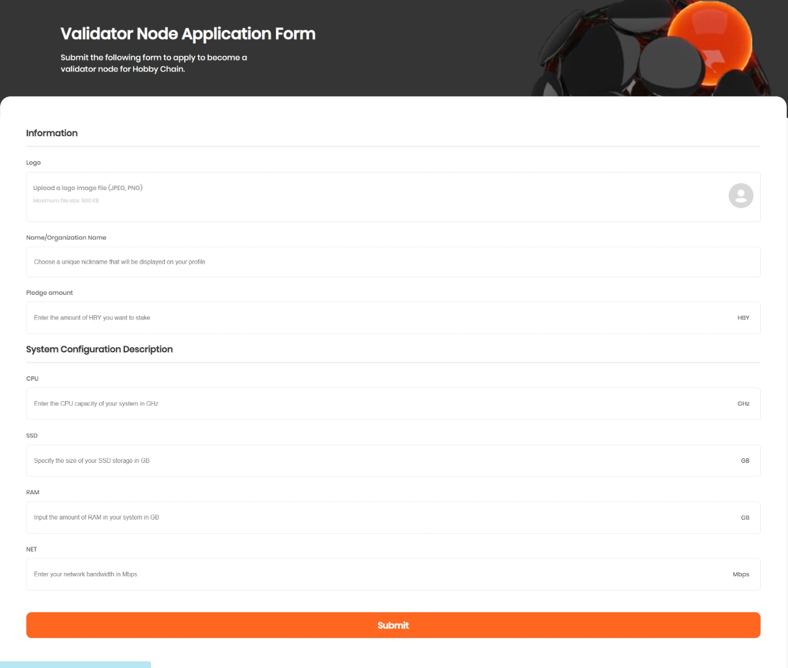
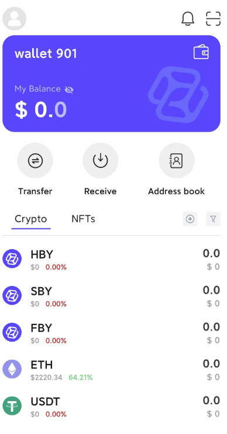
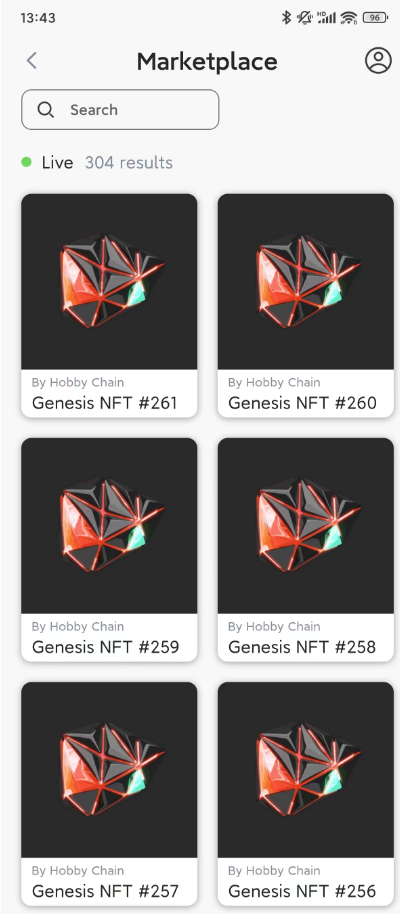
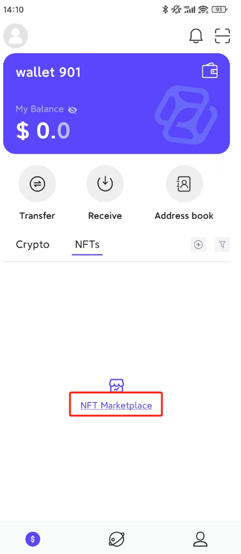
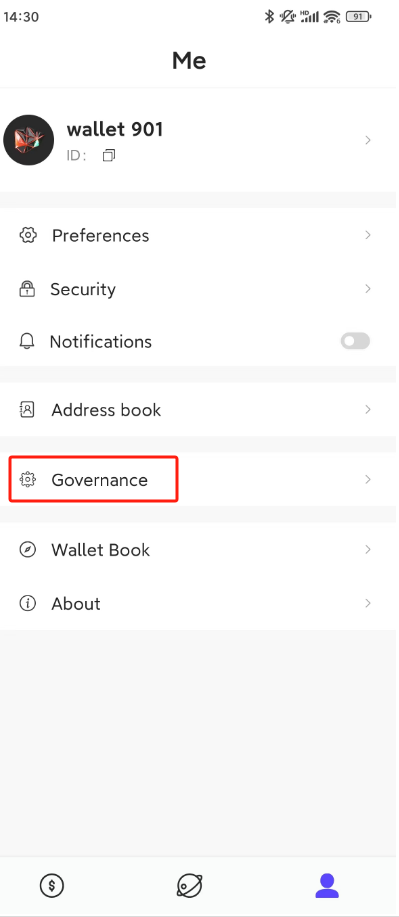
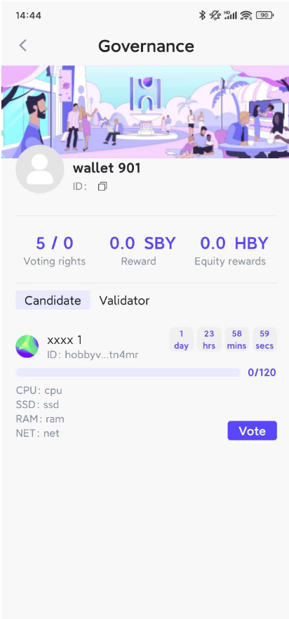

# Application Submission

- **Validation Node Requirements**

```text
* 8 or more physical CPU cores
* At least 2 Terabyte NVMe SSD storage
* Minimum of 32GB RAM
* Minimum network bandwidth of 100Mbps
```


- **Submit the application form via the official website**

[ApplicationForm | HOBBY CHAIN](https://hobbychain.org/pages/vaildatorForm/)



- **Submit the application form and await the review results**

# Stake tokens

- **View node's public key**

```sh
$ hobbyd tendermint show-validator
{"@type":"/cosmos.crypto.ed25519.PubKey","key":"QZF97pWZln/K1pdvH3fwmbsc3gwgJ+YFyspnrUmZ1ts="}
```


- **Send staking message** 

After the application is approved, perform the following actions on the node host to become a candidate node. The staking amount --amount should match the amount specified in the application form.

```sh
$ hobbyd tx staking create-validator \
  --from hobby108phdr0tnruscqawpvdgx6f5p3patjh7c52l5l \
  --pubkey '{"@type":"/cosmos.crypto.ed25519.PubKey","key":"QZF97pWZln/K1pdvH3fwmbsc3gwgJ+YFyspnrUmZ1ts="}' \
  --amount 1000000000000000000000uhby \
  --commission-max-change-rate 0.1  \
  --commission-max-rate 0.1 \
  --commission-rate 0.1  \
  --min-self-delegation 1000000000000000000 \
  --gas auto \
  --gas-adjustment 2 \
  --gas-prices 50000000000uhby 
```


# Meta Human Voting

+ Enter the voting phase, which lasts for 24,480 blocks (48 hours). During this period, each Meta Human holding an NFT can only vote once. 
+ If the number of votes remains below 80 for more than 48 hours (calculated in block height), the candidate's eligibility will be revoked.
+ If a validator reaches the full vote count of 120 votes, other Meta Human individuals holding NFTs will not be able to cast further votes for that validator. 

### Download the wallet app
Open the official website's app download page and download the appropriate app version for your system.

[Wallet Download | HOBBY CHAIN](https://hobbychain.org/pages/download/)

### Create your own wallet
Follow the prompts in the wallet app to create a crypto wallet using a passphrase.



### Purchase a Genesis NFT
Open the NFTs list, select the NFT you wish to purchase, and pay the price in USDT.



### Link Meta Human Identity

-Open my NFT list. If you haven't made a purchase yet, click on NFT Marketplace to buy an NFT.



- Select the purchased NFT to perform identity linking.


### Vote for a Candidate

- On the governance page, click on the 'candidate' tab to select the candidate you want to vote for.



- Click the 'vote' button from the list of candidate nodes to cast your vote for the candidate. You can select multiple NFTs when voting.



- Once a voter successfully casts their vote, they cannot retract it for the entire voting period. Additionally, the selected NFTs will be locked and cannot be transferred during this time.

# Meta Human Withdraws Vote

A Meta Human can only withdraw their vote after the voting period has ended.

- Open your wallet, find the node you voted for in the list of candidates or validators, and click 'Revoke' to withdraw your vote.


# Candidate/Validator Withdraws Application


A candidate node can only withdraw its application after the voting period has ended.
- Open your wallet, find your node information in the candidates list, and click the 'Withdraw' button to complete the withdrawal of your application and unbind the staked tokens.

A validator node can only unstake and exit their validator identity after the committed operating period has been fulfilled.

- Open the wallet, locate your information in the validators list, and click the 'Unstake' button to withdraw staked tokens and exit the validator identity.


