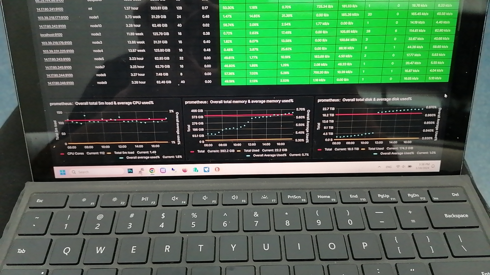

# Introduction



 Our testnet has been launched, and the following test cases are mainly aimed at conducting functional tests on the API of blockchain nodes.

# Tokens transfer

send uhby and usby tokens to a account of hobby chain from validator10 account 

```sh
$ docker exec -it coeus-node hobbyd tx bank send validator10 hobby1lu08pnjhp6v54mxurampudwr47a62fzqg3z799 80123456789000000000uhby,80123456789000000000usby  --from validator10 --gas auto --gas-adjustment 2 --gas-prices 50000000uhby,50000000usby -y
```

query the target account token balances

```sh
$ docker exec -it coeus-node hobbyd query bank spendable-balances hobby1lu08pnjhp6v54mxurampudwr47a62fzqg3z799
```

# Private data 

## Store private data 

- write my key and value to chain

```sh
$ docker exec -it coeus-node hobbyd tx hobby private-data mykey1 "this is my private data" --from validator10 --gas auto --gas-adjustment 2 --gas-prices 50000000usby -y
```

## query private data

- read my value from chain by my key

```sh
$ docker exec -it coeus-node hobbyd query hobby private-data hobby1rwtj3dkk8pv3cmstv3mj7nlcdp5mdcd5758ylw mykey1
value: this is my private data
```

# Denom exchange

in this case, we can exchange the uhby to usby

```sh
$ docker exec -it coeus-node hobbyd tx hobby  demon-exchange  10000000000000000000  --from validator10 --gas auto --gas-adjustment 2 --gas-prices 50000000uhby -y

Enter keyring passphrase (attempt 1/3):
gas estimate: 207934
code: 0
codespace: ""
data: ""
events: []
gas_used: "0"
gas_wanted: "0"
height: "0"
info: ""
logs: []
raw_log: '[]'
timestamp: ""
tx: null
txhash: 051FACB23D1ABA2AC6C6A01993DF57513479B806A8B69FB841637696CDF6E154
```

query the transaction receipt of exchange

```sh
$ docker exec -it coeus-node hobbyd query tx 051FACB23D1ABA2AC6C6A01993DF57513479B806A8B69FB841637696CDF6E154
```


